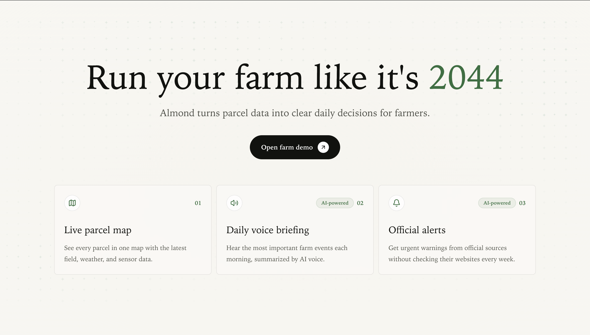

# Almond

🌱 **AI parcel intelligence for farmers**

Almond is a hackathon prototype built during the **Tech Europe Paris AI Hackathon**.

It helps a farmer quickly understand what is happening across their land parcels by combining parcel data, weather, public updates, and AI-generated explanations in one simple dashboard.

## ✨ What It Does

- Shows parcel and crop information clearly
- Highlights weather, water, and field risks
- Summarizes what needs attention
- Lets the farmer ask questions through an AI assistant
- Turns scattered data into practical next steps

## 🤖 AI Features

- **AI assistant:** answers questions about parcels, crops, risks, and actions
- **Smart summaries:** explains complex parcel signals in plain language
- **SLNG voice layer:** supports speech-to-text-to-speech flows for spoken briefings and voice-style interaction
- **Tavily web search:** searches the internet for useful public documents, official updates, and external context
- **Daily briefings:** creates short summaries from parcel, weather, document, and restriction data

## 🛰️ Data Represented

- Parcel and crop data
- Weather signals
- Water restrictions
- Public documents and official updates
- Satellite, sensor, and drone-style observations

## 🛠️ Built With

- Next.js
- TypeScript
- React
- Tailwind CSS
- OpenAI
- SLNG
- Tavily

## 🏁 Hackathon Context

This was built fast for a Paris hackathon demo.

The goal was not to build a full production farming platform. The goal was to show how AI can help farmers move from scattered agricultural data to clear, useful decisions.

Some data is mocked or simplified so the demo stays focused and easy to understand.

## 📌 Status

Hackathon prototype, preserved as a snapshot of the project built in Paris.
